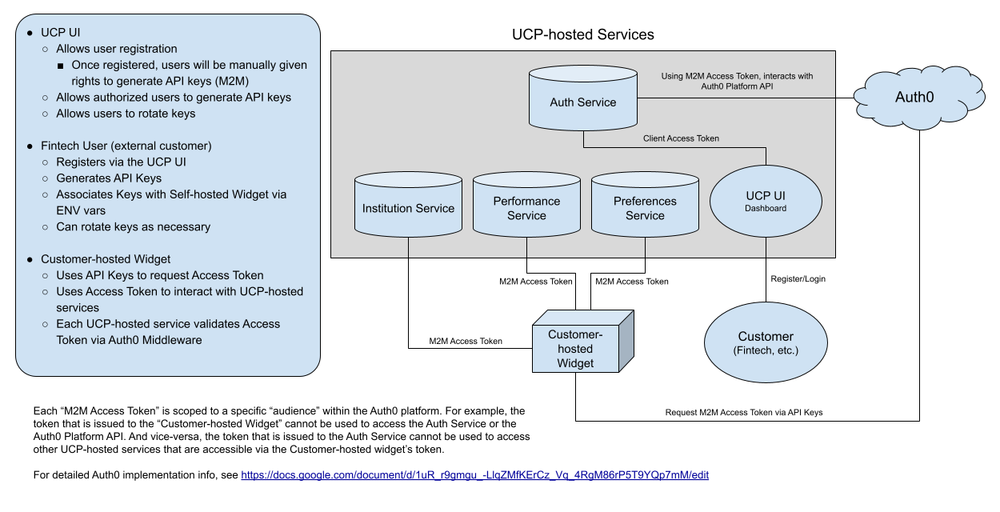

# Authentication Architecture

Below is a diagram of the authentication architecture for communication between a customer-hosted UCW-App instance, and
the UCP-hosted Services.

The following is an outline of the process used to allow a customers’ self-hosted ucw-app to communicate with the
UCP-hosted services (ucp-hosted-apps), such as Institutions, Performance, Preferences, etc.

This process holds to the goal of not requiring UCP services to always be online in order for the customers’ ucw-app to
function properly.

However, in order for our customers to update their caches with the latest data from UCP services, they must create an
account and get their required client id/secret values.

If they choose not to update their caches, or if for some reason any of these UCP services are down, then the ucw-app
will continue to function as expected due to the code shipping with default caches (institution, preferences, etc.).

The process is as follows:

1. A UCP customer will register via the UCP-UI Dashboard (URL TBD).
1. The user will request access to generate api keys
1. As part of the api key creation process, the UCP Authentication service will create a new Application on the Auth0
   platform. The Application ID is stored in the Auth0 User’s user_metadata object, so that we know which application a
   user is associated with.
1. This new Application will have an associated client_id, and client_secret, which the customer will be able to get
   from the Auth UI Dashboard. They will put the id/secret values in the .env file of their ucw-app server instance.
1. These values will reside in the .env vars AUTH_CLIENT_ID and AUTH_CLIENT_SECRET, respectively. (var names could
   change as this portion has not yet been implemented, and is a post-Phase 1 item). The customer will be able to
   retrieve the id/secret via our UI. This mirrors what Auth0 allows in their system.
1. Users will also be able to rotate their secret, via the UI.
1. Using Auth0’s Client Credentials Flow, our customers’ self-hosted ucw-app will then be able to use their assigned
   ClientID/Secret to request an authentication token from Auth0’s service.
